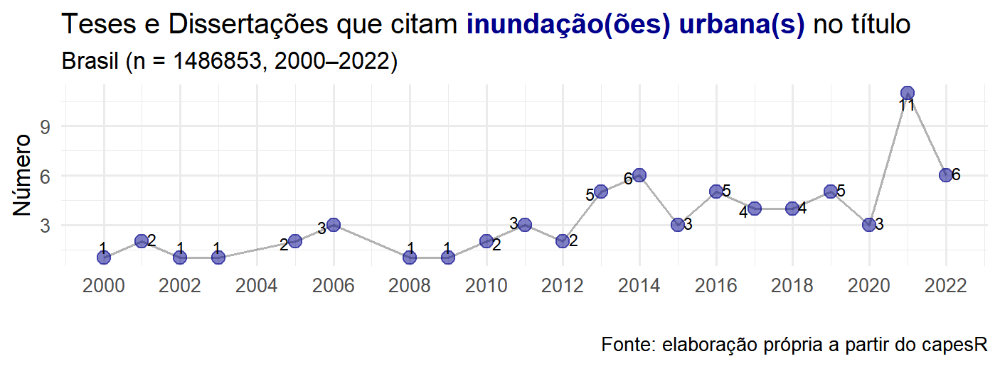
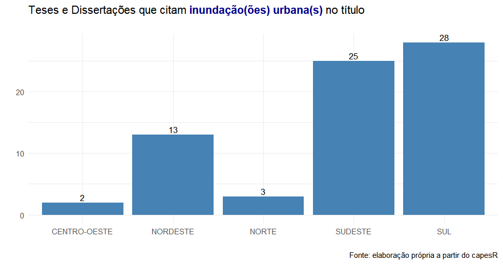

# Readme

\

parâmetros utilizados:\
toda base disponível (1987-2022)\
palavras chave: "inundação urbana", "inundações urbanas",\
                  "inundação da área urbana",  "inundações da área urbana",\
                  "inundação das áreas urbana",  "inundações das áreas urbana",\
                  "inundação na área urbana",  "inundações na área urbana",\
                  "inundação nas áreas urbana",  "inundações nas áreas urbana",\
                  "inundação em área urbana",  "inundações em área urbana",\
                  "inundação em áreas urbana",  "inundações em áreas urbana"

